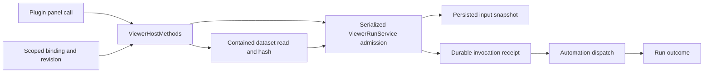

# Orca Plugin Viewer Current Implementation

Repository roots: **code** = `/Users/matsuyay/workspace/nowly-lab/nowly-ai-sandbox/orca`; **knowledge** = `/Users/matsuyay/workspace/nowly-lab/nowly-ai-sandbox/orca`. Checked at: 2026-09-20, branch `codex/custom-viewer-design`, HEAD `6911b6a57ffcd17fa262df924189538d28090459`. Prior documentation edits and any other pre-existing working-tree changes are retained. Source reading only; no application, provider, simulator or deployment check was run.

Status: current product documentation. Observed implementation, accepted target and unresolved delivery are labeled separately; no new product behavior is approved here.

This scoped engineering SSoT describes the inspected fork's plugin viewer source, not nowly-orca business data or the built-in HTML/PDF viewer. A dedicated accepted custom-viewer feature proposal was not found in the inspected docs; source facts below do not invent that approval. Repository AGENTS.md still owns platform/SSH/folder/remote-wire constraints.

## Current Ownership And Flow

Bindings are scoped by workspaceId/pluginKey/panelId. Updating a binding creates a new revision. ViewerHostMethods rejects a mismatched bindingRevision, returns unconfigured only for viewer.context without a binding, validates a configured binding, and routes context/data/dispatch/runs. Shared DTOs carry the contract; execution-host code owns validation and effects.

## Admission And Replay Semantics

| Step | Actual guard / result | Owner |
| --- | --- | --- |
| Parse | bounded requestId/text/selectedIds; selection or text required | CONTRACT |
| Serialize | requests chain through pending admission | RUN |
| Binding | current revision required | HOST / RUN |
| Replay | scope+requestId receipt key; same payload hash reuses run, differing payload conflicts | RUN |
| Time | new request must be within 300000 ms of current time | RUN |
| Dataset | current dataset revision and selected IDs; size and path containment checks | DATA / RUN |
| Target | revalidate after file I/O; automationTargetKey must still match | RUN |
| Accept | write input snapshot, create durable invocation receipt/run | RUN |
| Dispatch | dispatch effective prompt with reuseSession=false; dispatch failure is recorded | RUN |

An accepted receipt means durable admission, not successful completion of the automation. Retry/replay returns the existing run rather than launching a duplicate. The data boundary checks real paths, regular files, size and mutation during read; JSON/Markdown dataset parsing and revision selection stay host-owned.

## Preserved Boundaries And Open Scope

Viewer binding storage, shared schema, dataset reading and run dispatch are intentionally separate responsibilities. No refactor/file move is justified by this documentation synchronization. Do not consolidate renderer policy with execution-host effects. Preserve SSH execution-host ownership, folder workspaces, remote-version compatibility and OS behavior from AGENTS.md; those guarantees were not exercised at runtime here.

Unresolved: the exact accepted custom-viewer design/proposal and original delivery history. Built-in viewer user documentation is not a substitute approval. Future implementation selects one behavior, reads these owners/tests first, then records any old→new files, callers, preserved behavior and checks in the existing scoped design. No automation run, registration, provider effect or upstream sync is performed here.

## Current Change And Verification

The documentation now records actual binding→dataset→admission→receipt→dispatch semantics directly. Previous generic documentation guidance is preserved as historical evidence; latest rationale, source and check state live here. No code/test changes, moves or new product rules. Static source/path/link checks only; host/contract/run tests and Electron were not run. Documentation is local and ignored by existing `docs/**`; no ignore change or staging occurred. Durable current snapshot/index reside in nowly-orca `knowledges/implementation-documentation/orca/`. Source at the recorded HEAD is tracked; commit/merge/release of this documentation is not claimed.

## Related Files And Evidence

| Item / evidence ID | Root | Relative file path | Symbol / section | Role | Path state | Observation and decision rationale |
| --- | --- | --- | --- | --- | --- | --- |
| HOST | code | `src/main/plugins/viewer-host-methods.ts` | `ViewerHostMethods` | host dispatch | verified | Binding revision is checked before viewer context/data/dispatch/history operations. |
| CONTRACT | code | `src/shared/plugins/viewer-contract.ts` | `viewerDispatchInputSchema` | contract | verified | Bounds and unique selected IDs plus nonempty selection/text are enforced by shared schema. |
| RUN | code | `src/main/automations/viewer-run-service.ts` | `ViewerRunService` | workflow | verified | Serial admission validates binding/target, replay hash, request age, dataset revision and input size before durable acceptance. |
| DATA | code | `src/main/plugins/viewer-dataset.ts` | `readViewerDataset` | file boundary | verified | Contained regular file, size and change checks plus hash revision; duplicate item IDs rejected. |
| BINDING | code | `src/main/plugins/viewer-binding-store.ts` | `ViewerBindingStore` | persistence | verified | Scope keys bind workspace/plugin/panel; put creates a new revision and secure file persistence. |
| HOST-TEST | code | `src/main/plugins/viewer-host-methods.test.ts` | `resolves data and dispatch from the bound workspace` | test | verified | Source fixture exists; not executed. |
| RUN-TEST | code | `src/main/automations/viewer-run-service.test.ts` | `ViewerRunService` | test | verified | Existing source covers admission/dispatch behavior; not executed. |
