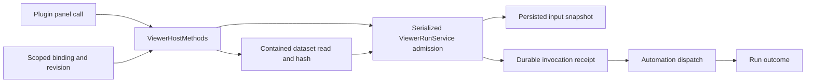

# Orca Plugin Viewer Current Implementation

Repository roots: **code** and **knowledge** = the Orca repository; persistent source checkout `/Users/matsuyay/workspace/nowly-lab/nowly-ai-sandbox/orca`, validation worktree `/Users/matsuyay/workspace/nowly-lab/nowly-ai-sandbox/orca-integration-20260921`. Checked at: 2026-09-21, branch `codex/parallel-work-main-20260921`. Integration code revision `e3a6b857b3f65eeed67a21cbea656e2d38a26faf` merges source `6911b6a57ffcd17fa262df924189538d28090459` with fork main `3bd0f9677769`; the following documentation update changes no code. Original `codex/custom-viewer-design` checkout is preserved.

Status: current product documentation. Observed implementation, accepted target and unresolved delivery are labeled separately; no new product behavior is approved here.

This scoped engineering SSoT describes the inspected fork's plugin viewer source, not nowly-orca business data or the built-in HTML/PDF viewer. The user explicitly authorized integrating the six existing custom-viewer commits on 2026-09-21. This integration preserves their behavior; it does not introduce a new feature design or authorize a release. Repository AGENTS.md still owns platform/SSH/folder/remote-wire constraints.

## Current Ownership And Flow

Bindings are scoped by workspaceId/pluginKey/panelId. Updating a binding creates a new revision. ViewerHostMethods rejects a mismatched bindingRevision, returns unconfigured only for viewer.context without a binding, validates a configured binding, and routes context/data/dispatch/runs. Shared DTOs carry the contract; execution-host code owns validation and effects.

## Admission And Replay Semantics

| Step | Actual guard / result | Owner |
| --- | --- | --- |
| Parse | bounded requestId/text/selectedIds; selection or text required | CONTRACT |
| Serialize | requests chain through pending admission | RUN |
| Binding | current revision required | HOST / RUN |
| Replay | scope+requestId receipt key; same payload hash reuses run, differing payload conflicts | RUN |
| Time | new request must be within 300000 ms of current time | RUN |
| Dataset | current dataset revision and selected IDs; size and path containment checks | DATA / RUN |
| Target | revalidate after file I/O; automationTargetKey must still match | RUN |
| Accept | write input snapshot, create durable invocation receipt/run | RUN |
| Dispatch | dispatch effective prompt with reuseSession=false; dispatch failure is recorded | RUN |

An accepted receipt means durable admission, not successful completion of the automation. Retry/replay returns the existing run rather than launching a duplicate. The data boundary checks real paths, regular files, size and mutation during read; JSON/Markdown dataset parsing and revision selection stay host-owned.

## Preserved Boundaries And Open Scope

Viewer binding storage, shared schema, dataset reading and run dispatch are intentionally separate responsibilities. No refactor/file move is justified by this documentation synchronization. Do not consolidate renderer policy with execution-host effects. Preserve execution-host ownership and OS behavior from AGENTS.md. This implementation supports local desktop workspaces, including local folder workspaces resolved through project groups. `resolveViewerWorkspaceProject` rejects SSH/remote hosts; mobile projections omit plugin-viewer tabs and the renderer reports local-only availability where the bridge is absent. This is an explicit unsupported boundary, not remote execution support; Windows/Linux and live SSH were not exercised.

The earlier dedicated design/proposal history remains unlocated; source semantics above and the explicit integration request bound this merge. No new refactor is justified: current files remain at the same paths, and callers, authorization fences, request replay, dataset limits and automation prechecks stay intact. Live provider execution, deployment and installed-app updates are outside this integration.

## Current Change And Verification

The integration preserves all six viewer commits and the newer main documentation commit without conflicts. It includes local viewer contracts/bindings, bounded JSON/Markdown dataset reads, durable serialized invocation admission/replay, automation dispatch/recovery, workspace tabs, and per-task/bulk sample controls. No product code fix or dependency/lockfile change was needed.

Validation on 2026-09-21 in the isolated integration worktree (pnpm 12.0.0):

| Check | Actual result and coverage |
| --- | --- |
| `pnpm tc` | Passed node/CLI/web type checks |
| `pnpm run check:code-quality:changed` | Passed all seven gates; 89 code files, zero new findings against fork main `3bd0f9677769` |
| `pnpm test src/main/plugins src/main/automations/viewer src/shared/plugins src/shared/viewer src/renderer/src/components/plugin-viewer src/renderer/src/store/slices/tabs/tabs-viewer-actions.test.ts tests/e2e/viewer-sample-panel.unit.test.ts` | 75 test files / 420 tests passed; contract, dataset, admission/persistence, consent/panel host, renderer and sample behavior |
| `pnpm test src/main/automations/service.test.ts src/main/automations/service-precheck.test.ts src/main/automations/run-completion-watcher.test.ts` | 3 files / 29 tests passed; shared automation dispatch/precheck/recovery regression |
| `pnpm exec electron-vite build --mode e2e` | Passed; freshly built background launch policy and test renderer |
| `ORCA_BACKGROUND_LAUNCH=1 SKIP_BUILD=1 pnpm run test:e2e tests/e2e/plugin-viewer-automation.spec.ts tests/e2e/plugin-demo.spec.ts --workers=1` | 2 passed; isolated userData/test repositories, real IPC and DOM, per-task/bulk dispatch with synthetic failing precheck, plugin consent, light/dark and narrow viewport. Hidden-renderer screenshots reviewed; no live agent/provider run |

All tests used `ORCA_BACKGROUND_LAUNCH=1`. Test launch did not reveal/focus windows. Windows/Linux packaging, live SSH, live provider completion and installed-app operation remain untested. The E2E CLI build attempted its standard optional `orca-dev` symlink and reported permission denied; the isolated CLI build and both tests nevertheless passed, and no installed app was updated.

This document is tracked in the integration candidate. Git delivery is a local integration candidate pending independent review/main push at this check; release/deployment is not claimed. Keep this SSoT in the persistent product repository before any worktree removal; the earlier nowly-orca snapshot is historical source-inspection evidence, not the current validation record.

## Related Files And Evidence

| Item / evidence ID | Root | Relative file path | Symbol / section | Role | Path state | Observation and decision rationale |
| --- | --- | --- | --- | --- | --- | --- |
| HOST | code | `src/main/plugins/viewer-host-methods.ts` | `ViewerHostMethods` | host dispatch | verified | Binding revision is checked before viewer context/data/dispatch/history operations. |
| CONTRACT | code | `src/shared/plugins/viewer-contract.ts` | `viewerDispatchInputSchema` | contract | verified | Bounds and unique selected IDs plus nonempty selection/text are enforced by shared schema. |
| RUN | code | `src/main/automations/viewer-run-service.ts` | `ViewerRunService` | workflow | verified | Serial admission validates binding/target, replay hash, request age, dataset revision and input size before durable acceptance. |
| DATA | code | `src/main/plugins/viewer-dataset.ts` | `readViewerDataset` | file boundary | verified | Contained regular file, size and change checks plus hash revision; duplicate item IDs rejected. |
| BINDING | code | `src/main/plugins/viewer-binding-store.ts` | `ViewerBindingStore` | persistence | verified | Scope keys bind workspace/plugin/panel; put creates a new revision and secure file persistence. |
| HOST-TEST | code | `src/main/plugins/viewer-host-methods.test.ts` | `resolves data and dispatch from the bound workspace` | test | verified | Existing host fixture passed in the 2026-09-21 related test run. |
| RUN-TEST | code | `src/main/automations/viewer-run-service.test.ts` | `ViewerRunService` | test | verified | Admission/dispatch regression tests passed in the 2026-09-21 related test run. |
